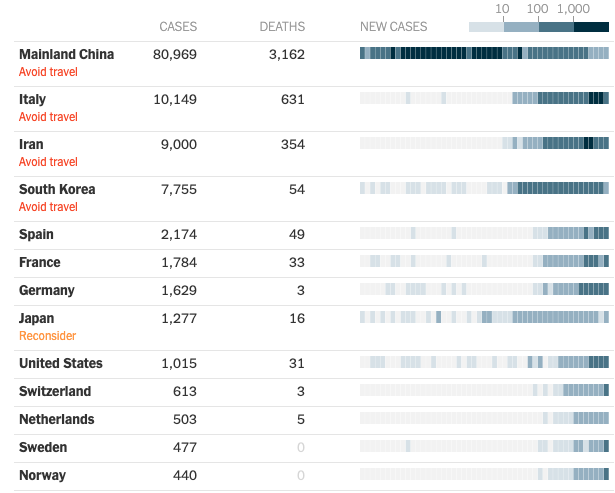

# COVID19-mortality

### In this project, we attempt to estimate the true mortality rate for COVID-19 (the "new coronavirus") while controlling for country-level covariates such as access to healthcare and age of population.

The observed mortality of COVID-19 has varied widely from country to country (as of early March 2020), which makes it difficult to get a handle on the actual mortality rate of the virus. For instance, as of March 10, mortality rates have ranged from < 0.1% in places like Germany (1100+ cases) to upwards of 5% in Italy (9000+ cases) and 3.9% in China (80k+ cases).  This is clearly seen in the NYT infographic (New York Times, March 11):

As of March 10, the overall reported mortality rate is 3.5%. However, this figure does not account for systematic biases in case reporting and testing in countries for which the outbreak is more mature.  The point of our modelling work here is to try to understand and correct for the country-to-country differences that may cause the observed discrepancies in COVID-19 country-wide mortality rates. That way we can "undo" those biases and try to pin down an overall real mortality rate.

### See the full analysis here:

* [COVID-19 Mortality Analysis](COVID-19 Mortality Rate.ipynb)

For questions or comments email [Joseph Richards](joeyrichar@gmail.com).

